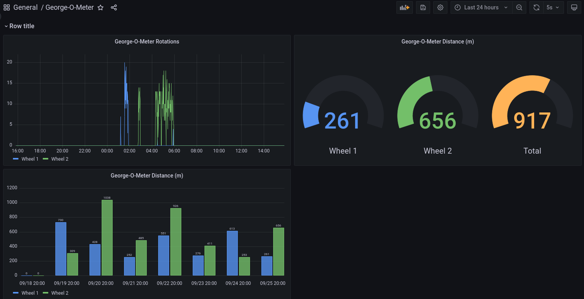

# george-o-meter
pico w with a hall sensor to measure rotations of a wheel

The pico will send data to an MQTT instance.  Telegraf can be configured to pull that data and insert into influxdb.  However once its in MQTT you can send it wherever you'd like.

To get started, you will need to save hall_sensor.py as main.py on the pico w.   You will also need a file named secrets.py to hold your configuration data.  secrets.py should contain the following:

mqtt_server = ''  #IP or url to your mqtt server   
mqtt_user = '' 
mqtt_password = '' 
client_id = 'wheel1'  #whatever you want to name the microcontroller 
ssid = ''  #Wireless SSIS 
ssid_pass = '' #Wireless SSID Password 

Once the data is feeding into influxdb you should see something similar to the dashboard below.

